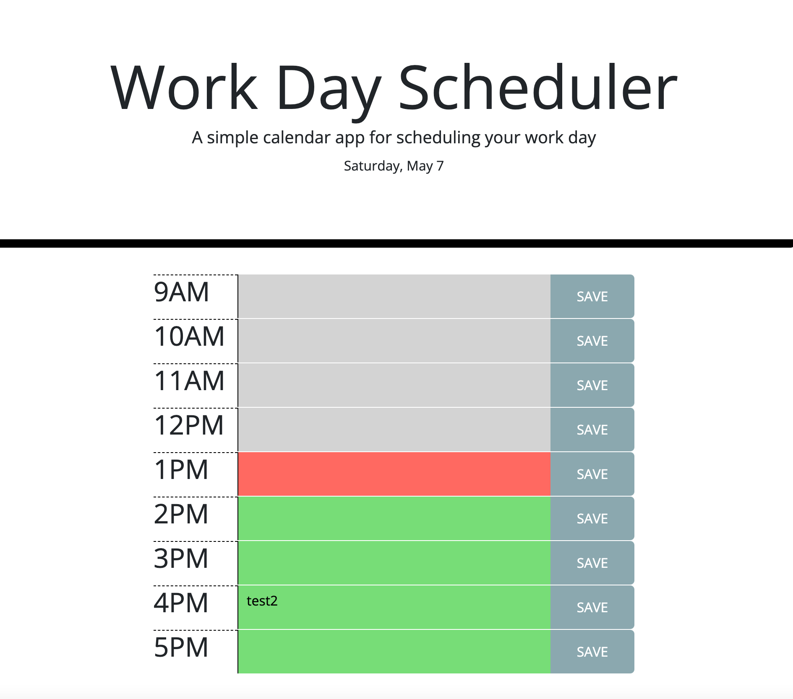

# UWCB-04-Homework
UW Coding Bootcamp : Homework 05

## Description

An app to plan out your work day, hour by hour, from 9am to 5pm. Only applies to current day. Rows are color coded by past, present (hour), and future. I used DayJS, instead of Moment, and for future releases I would disable the "past" hour rows, since there's no point in logging an entry in the past.
## Page Link
<a href="https://pdubya1632.github.io/UWCB-05-Homework/index.html">https://pdubya1632.github.io/UWCB-05-Homework/index.html</a>
## Preview

